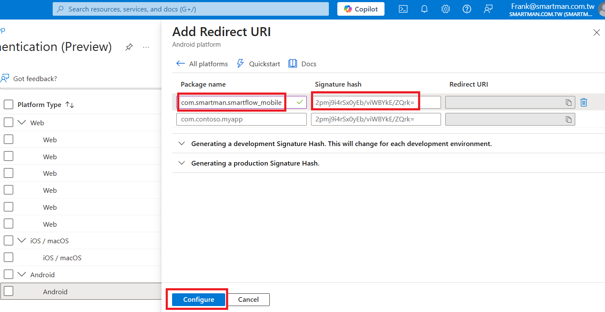
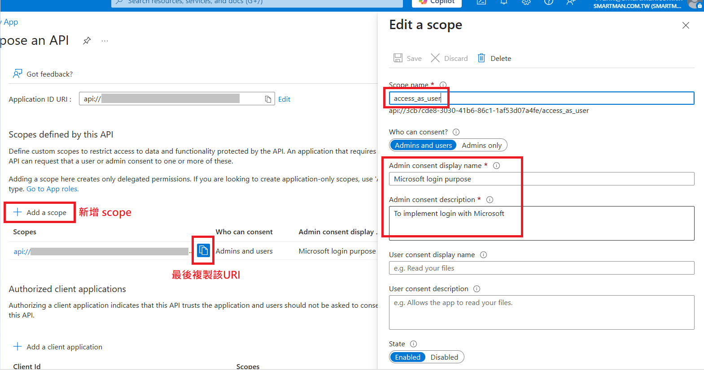

# 如何在 Azure App Registrations 建立 SmartFlow App 應用程式
底下資訊將說明如何在 Azure App Registrations 中建立 SmartFlow App 應用程式。

## 什麼是 Azure App Registrations?

Azure App Registrations 是 Microsoft Azure Active Directory (AD) 中的一項功能，讓開發者可以將他們的應用程式註冊到 Azure AD 租戶中。這允許應用程式使用 Azure AD 的驗證和授權服務，使用者可以透過其 Microsoft 帳戶進行身份驗證。

透過 App Registrations，開發者可以：

- 建立應用程式身份，獲取唯一的 Client ID 與 Client Secret 和 Tenant ID
- 定義應用程式所需的權限範圍 (Scope)
- 設定重新導向 URI (Redirect URI)
- 管理 API 權限和 OAuth 設定
- 實現單一登入 (SSO) 功能
<!-- Table of contents -->

## 目錄
- [如何在 Azure App Registrations 建立 SmartFlow App 應用程式](#如何在-azure-app-registrations-建立-smartflow-app-應用程式)
  - [什麼是 Azure App Registrations?](#什麼是-azure-app-registrations)
  - [目錄](#目錄)
  - [登入 Azure Portal](#登入-azure-portal)
  - [建立新的 registration](#建立新的-registration)
  - [加入Redirect](#加入redirect)
  - [新增 Web 平台](#新增-web-平台)
  - [新增 Android 平台](#新增-android-平台)
  - [新增 iOS 平台](#新增-ios-平台)
  - [新增 Certificates \& secrets](#新增-certificates--secrets)
  - [新增應用程式ID URI](#新增應用程式id-uri)

## 登入 Azure Portal
1. 前往 [Azure Portal](https://portal.azure.com/) 並透過管理者資訊登入。
2. 開啟 App registrations
## 建立新的 registration
1. 點擊 "New registration" 按鈕。
2. Name欄位輸入 SmartFlow App —> 按下最底部註冊 (Register)
(Supported account types可依照需求選擇，Redirect URL 先不需要填寫)
> 請依照貴司組織規則設定 Supported account types
3. Client ID 和 Tenant ID 複製下來，後續Flow後台設定貼上使用。
> 分別對應Flow的 應用程式(用戶端)識別碼 和 目錄(租用戶)識別碼
> Flow設定頁面參考

## 加入Redirect
1. 點 Overview > 前往 Redirect URIs 設定頁面
2. 按新增Add Redirect URI 

## 新增 Web 平台
1. 選擇 Web
2. 新增Flow設定頁面內的兩組URL進入
> Flow設定頁面內的  重新導向URI 1 和 重新導向URI 2
   
## 新增 Android 平台
1. 選擇 Android
2. Package name 輸入 `com.smartman.smartflow_mobile`—> Signature hash 輸入志元提供給您的雜湊簽章字串 —> 最後按下 Configure
3. 建立完成後請將MSAL Configuration的JSON格式資料提供給志元。

## 新增 iOS 平台
1. 選擇 iOS
2. Bundle ID 輸入 `com.smartman.smartflow-mobile.ios` —> 按下底部的 Configure
3. 將 MSAL Configuration 複製後提供給志元。

## 新增 Certificates & secrets
1. 新增 secrets
   > 使用期限依公司規範設定，但每次過期更新設定，Flow設定完成後，需要重啟IIS或AP主機重新開機
2. 複製 secrets Value 到Flow設定 用戶端密碼(秘密)欄位，請注意此秘密欄位只會在當下顯示，後續就不會再顯示，如遺失請重新設定一組

## 新增應用程式ID URI
1. 點擊左側的 "Expose an API"，設定應用程式 ID URI。內容輸入 `api://{應用程式 ID}`，其中 `{應用程式 ID}` 是您在註冊時獲得的應用程式 ID。
2. 點選 Add a scope，Scope name 輸入 `access_as_user`，並填寫其他必要資訊。最後複製應用程式 ID URI，並提供給志元。
> [若有任何問題歡迎透過 frank@smartman.com.tw 與我們聯繫](mailto:frank@smartman.com.tw?subject=SmartFlow%20App%20Azure_App_Registration詢問) [(Feel free to contact us if you have any questions through frank@smartman.com.tw)](mailto:frank@smartman.com.tw?subject=SmartFlow%20App%20Azure_App_Registration詢問)
