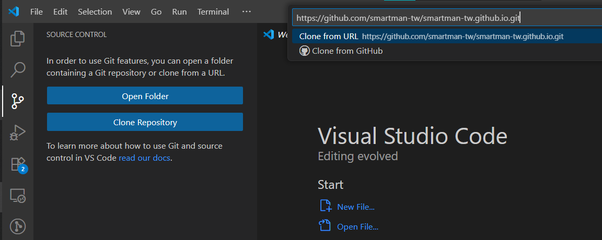
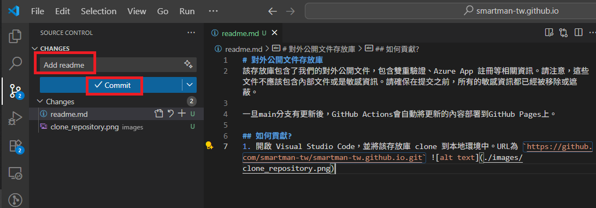

# 對外公開文件存放庫
該存放庫包含了我們的對外公開文件，包含雙重驗證、Azure App 註冊等相關資訊。請注意，這些文件不應該包含內部文件或是敏感資訊。請確保在提交之前，所有的敏感資訊都已經被移除或遮蔽。

一旦main分支有更新後，GitHub Actions會自動將更新的內容部署到GitHub Pages上。網站可以透過資料夾切分頁面，如 `docs` 資料夾建立後網址為 `https://smartman-tw.github.io/docs/`。

## 如何貢獻?
1. 開啟 Visual Studio Code，並將該存放庫 clone 到本地環境中。URL為 `https://github.com/smartman-tw/smartman-tw.github.io.git` 
2. 完成變更後，輸入 commit 訊息，並提交到 main 分支。
3. 推上去之後，GitHub Actions 會自動將更新的內容部署到 GitHub Pages 上。你可以在 `https://smartman-tw.github.io/` 查看最新的變更。